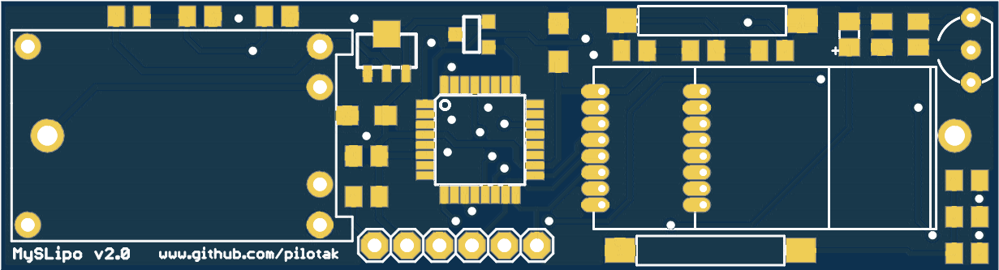
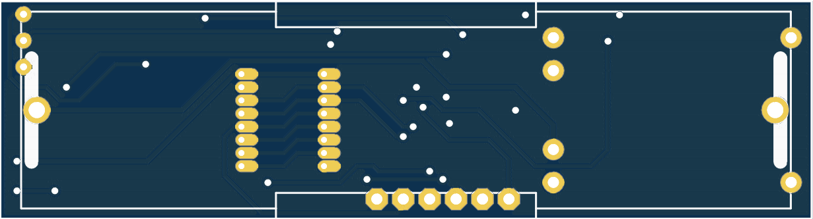

# MySensors Li-po/USB powered wirelles node
PCB size as 18500 Li-po battery board with ATmega328p with integrated USB charger and battery protection IC. Supports ATSHA204A CryptoAuth chip and DS18B20 temperature IC.

### Power consumption
Sleep: 58.1uA
Wakeup: 18.2mA

Supported radios:
* NRF24L01 SMD
* NRF24L01+LNA+PA SMD

Pins used:
* D2 = reed switch 1
* D3 = reed switch 2
* D4 = 1-Wire bus with R2 pull-up to D5
* D5 = 1-Wire supply
* D7 = LED indication
* D9 = CE pin
* D10 = CSN
* SPI = radios
* A2 = ATSHA204A
* A7 = battery monitor

## PCB top view

## PCB bottom view

## Schematic

### ATmega328p fuses
- **HIGH:** DA
- **LOW:** E2
- **EXTENDED:** 06

**NOTE:**
HEX files already contain *Sensebender Micro* bootloader - fully ready for MySensors network and [OTA updates](https://www.mysensors.org/about/ota), can be flashed with [Arduino as ISP programmer](https://www.arduino.cc/en/Tutorial/ArduinoISP) or any other AVR-ISP